来了解一下nodejs以及相关的工具。

<!-- more -->

## <font size=3>一、Node.js</font>

### <font size=3>1. Node.js是什么？</font>

Node.js的官网是[Node.js — 在任何地方运行 JavaScript](https://nodejs.org/zh-cn)，看一下官网怎么说的：

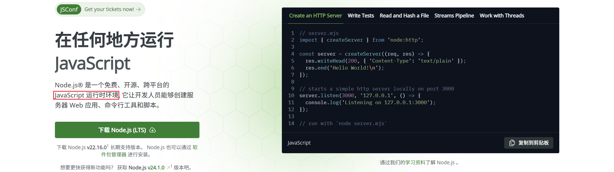

可以看到，官网只有一句话：**Node.js® 是一个免费、开源、跨平台的 JavaScript 运行时环境, 它让开发人员能够创建服务器 Web 应用、命令行工具和脚本。**（实际上更详细的可以去看它的文档：[Node.js 中文网 — Node.js 简介](https://nodejs.cn/en/learn)）

简单来说，它就是一个JavaScript程序的运行环境。在Node.js出现之前，使用JavaScript语言编写的脚本需要在网页中被`<script>`标签引用后才能执行，这就使得前端开发人员编写的程序无论怎么看都像是界面的一种附属品。**而Node.js的出现打破了这个枷锁**，它提供的运行时能够让JavaScript程序在桌面、命令行终端、手机、平板电脑甚至嵌入式系统上运行，这不仅极大地丰富了JavaScript的应用场景，也为后来的前端工程化发展和中间层架构模型的兴起奠定了基础。

了解到这里，就大概知道了Node.js是什么，它的发展历史这里就不详细去了解了，可以看[Node.js - 维基百科，自由的百科全书](https://zh.wikipedia.org/wiki/Node.js)

>参考资料：
>
>- [Node.js是什么？能做什么？终于有人讲明白了-腾讯云开发者社区-腾讯云](https://cloud.tencent.com/developer/article/2216314)

### <font size=3>2. 它可以做什么？</font>

> Tips：下面这段是照搬 [Windows 上的 NodeJS | Microsoft Learn](https://learn.microsoft.com/zh-cn/windows/dev-environment/javascript/nodejs-overview)这部分的，说实话，我并不做javascript开发，对此了解的并不是很深入，我觉得自己知道它可以生成web应用程序就可以了，后面会接触的hexo、VuePress、VitePress等静态网站生成器都离不开Node.js。

Node.js 主要用于生成快速且可缩放的 Web 应用程序。 它使用事件驱动的非阻塞 I/O 模型，使其轻量且高效。 它是跨分布式设备运行的数据密集型实时应用程序的绝佳框架。 下面是可以使用 Node.js创建的内容的几个示例。

- **单页应用（SPA）**：这些 Web 应用在浏览器中工作，无需每次使用它来获取新数据时都重新加载页面。 一些示例 SPA 包括社交网络应用、电子邮件或地图应用、在线文本或绘图工具等。
- **实时应用（RTA）**：这些 Web 应用允许用户在作者发布信息后立即接收信息，而不是要求用户（或软件）定期检查源以获取更新。 一些示例 RTA 包括即时消息应用或聊天室、可在浏览器中玩的在线多人游戏、在线协作文档、社区存储、视频会议应用等。
- **数据流式处理应用**：这些应用（或服务）在连接保持打开状态时发送数据/内容（或创建）以根据需要继续下载其他数据、内容或组件。 一些示例包括视频和音频流式处理应用。
- **REST API**：这些接口为其他人的 Web 应用提供与之交互的数据。 例如，日历 API 服务可以为其他人的本地活动网站使用的音乐会场地提供日期和时间。
- **服务器端渲染应用（SSR）**：这些 Web 应用可以在客户端（浏览器/前端）和服务器（后端）上运行，能够生成动态网页内容（HTML），同时能够快速获取未知但可用的内容。 这些应用程序通常称为“异态”或“通用”应用程序。 SSR 利用 SPA 方法，因此每次使用 SPA 方法时都不需要重新加载。 有些情况下，SSR 提供的一些优势可能对你来说很重要，也可能不是，例如，使你网站上的内容出现在 Google 搜索结果中；当你在社交媒体（如 X 或 Facebook）上分享应用链接时，提供预览图像。 潜在的缺点是，这需要 Node.js 服务器持续运行。 就示例而言，支持用户希望出现在搜索结果和社交媒体中的事件的社交网络应用可能会受益于 SSR，而电子邮件应用可能作为 SPA 正常。 还可以运行服务器呈现的 no-SPA 应用，这可能类似于 WordPress 博客。 如你所见，事情可能会变得复杂，只需确定重要事项。
- **命令行工具**：这些工具允许自动执行重复任务，然后将工具分发到庞大的 Node.js 生态系统中。 命令行工具的示例是 cURL，它代表客户端 URL，用于从 Internet URL 下载内容。 cURL 通常用于安装 Node.js 或在本例中安装 Node.js 版本管理器等内容。
- **硬件编程**：虽然不像 Web 应用那么受欢迎，但 Node.js 在 IoT 使用中越来越受欢迎，例如用于从传感器、信标、发射机、电机或任何生成大量数据的设备收集数据。 Node.js 可以启用数据收集、分析这些数据、在设备和服务器之间来回通信以及基于分析采取措施。 NPM 包含 80 多个适用于 Arduino 控制器、raspberry pi、Intel IoT Edison、各种传感器和蓝牙设备的包。

### <font size=3>3. 几种说法？</font>

“Node” 和 “Node.js” 本质上**指的是同一个东西**：一个基于 Chrome V8 JavaScript 引擎构建的 JavaScript **运行时环境**，用于在服务器端或本地执行 JavaScript 代码。它们之间的区别非常细微，主要体现在**命名习惯和书写形式上**:

| 特性         | Node.js                                | Node                                   |
| :----------- | :------------------------------------- | :------------------------------------- |
| **性质**     | **官方全称** (Runtime Environment)     | **常用简称** (Runtime Environment)     |
| **使用场景** | 官方文档、网站、商标、正式场合         | 日常交流、命令行、代码注释、社区讨论   |
| **书写形式** | 包含点号 `.` (Node**.**js)             | **不包含**点号 `.` (Node)              |
| **含义**     | **完全相同**，指 JavaScript 运行时环境 | **完全相同**，指 JavaScript 运行时环境 |
| **举例**     | “访问 Node.js 官网下载”                | “用 Node 运行这个脚本：`node app.js`”  |

而`node` 是在命令行中，启动程序的命令。

## <font size=3>二、包管理工具</font>

### <font size=3>1. 什么是包管理工具？</font>

首先，什么是包？包（package）代表了一组特定功能的源码集合。

然后，什么是包管理工具？其实也可以叫 [软件包管理系统](https://zh.wikipedia.org/wiki/软件包管理系统) ，**软件包管理系统**是在电脑中自动安装、配制、卸载和升级[软件包](https://zh.wikipedia.org/wiki/软件包)的工具组合，在各种[系统软件](https://zh.wikipedia.org/wiki/系统软件)和[应用软件](https://zh.wikipedia.org/wiki/应用软件)的安装管理中均有广泛应用。在Linux发行版中，几乎每一个发行版都有自己的软件包管理系统。常见的有：

- 管理[deb](https://zh.wikipedia.org/wiki/Deb)软件包的[dpkg](https://zh.wikipedia.org/wiki/Dpkg)以及它的[前端](https://zh.wikipedia.org/wiki/前端)[APT](https://zh.wikipedia.org/wiki/APT)（使用于[Debian](https://zh.wikipedia.org/wiki/Debian)、[Ubuntu](https://zh.wikipedia.org/wiki/Ubuntu)）。

- [RPM包管理员](https://zh.wikipedia.org/wiki/RPM套件管理員)以及它的前端[dnf](https://zh.wikipedia.org/wiki/DNF_(软件))（使用于[Fedora](https://zh.wikipedia.org/wiki/Fedora_(作業系統))、[Red Hat Enterprise Linux](https://zh.wikipedia.org/wiki/Red_Hat_Enterprise_Linux) 8、[CentOS](https://zh.wikipedia.org/wiki/CentOS) 8）、前端[yum](https://zh.wikipedia.org/wiki/Yum)（使用于[Red Hat Enterprise Linux](https://zh.wikipedia.org/wiki/Red_Hat_Enterprise_Linux)、[CentOS](https://zh.wikipedia.org/wiki/CentOS)）、前端[ZYpp](https://zh.wikipedia.org/wiki/ZYpp)（使用于[openSUSE](https://zh.wikipedia.org/wiki/OpenSUSE)）、前端[urpmi](https://zh.wikipedia.org/wiki/Urpmi)（使用于[Mandriva Linux](https://zh.wikipedia.org/wiki/Mandriva_Linux)、[Mageia](https://zh.wikipedia.org/wiki/Mageia)）等。

使用软件包管理系统将大大简化在[Linux发行版](https://zh.wikipedia.org/wiki/Linux发行版)中安装软件的过程。所以，其实这个概念是很明显的，就是个管理软件的安装卸载的工具，可以是像“软件中心”这样的图形化应用，比如手机中的应用商店，也可以是像 apt-get 或 pacman 这样的命令行工具。

Node.js **为了解决模块化开发带来的依赖管理复杂性、确保项目的一致性和可维护性，并促进庞大的 JavaScript 生态系统的协作**，它也有自己的包管理工具，如 npm、yarn、pnpm。

> Tips：后面将会了解到的 **npm**（全称 Node Package Manager，即“node包管理器”）就是[Node.js](https://zh.wikipedia.org/wiki/Node.js)默认的、用[JavaScript](https://zh.wikipedia.org/wiki/JavaScript)编写的[软件包管理系统](https://zh.wikipedia.org/wiki/軟體套件管理系統)。

### <font size=3>2. [npm](https://www.npmjs.com/)</font>

自 2009 年以来，Node.js 一直席卷全球。成千上万个系统基于 Node.js 构建，促使开发者在社区宣称“JavaScript 正在吞噬软件”。Node 成功的主要因素之一是它广受欢迎的软件包管理器——npm，因为 npm 使 JavaScript 开发人员可以快速方便地共享软件包， 例如 [lodash](https://www.npmjs.com/package/lodash) 和 [moment](https://www.npmjs.com/package/moment)。

> [npm | Home](https://www.npmjs.com/)
>
> [什么是 npm —— 写给初学者的编程教程](https://www.freecodecamp.org/chinese/news/what-is-npm-a-node-package-manager-tutorial-for-beginners/)

#### <font size=3>2.1 npm是什么？</font>

npm（Node Package Manager 即node包管理器”）是 JavaScript 运行时 Node.js 的默认程序包管理器。它也被称为“Ninja Pumpkin Mutants”，“Nonprofit Pizza Makers”，以及许多其他随机名称，可以在  [npm-expansions](https://github.com/npm/npm-expansions) 上探索这些名称。它的官网在这里：[npm | Home](https://www.npmjs.com/)。npm 由两个主要部分组成:

- 用于发布和下载程序包的 CLI（命令行界面）工具
- 托管 JavaScript 程序包的  [在线存储库](https://www.npmjs.com/)

NPM（Node Package Manager），作为默认的JavaScript应用包管理器，与Node.js一同安装，它是目前使用最广泛的包管理器，得益于其对大量包的强大支持。

在早期版本中，NPM缺乏对锁文件的支持，这意味着它无法维护应用所使用的依赖版本的确切记录。因此，版本控制的缺失常常导致兼容性问题，不同的环境可能会结束使用不同版本的依赖。此外，在更新之前，NPM允许在不同的机器上使用不同版本的包，这种灵活性不经意间可能导致重大变化，因为开发者可能会不经意间依赖于某个版本中存在而在另一个版本中缺失的特性或行为。后来，Yarn解决了这些问题，但是随后NPM也通过更新解决了这些问题。

#### <font size=3>2.2 package.json</font>

每个 JavaScript 项目（无论是 Node.js 还是浏览器应用程序）都可以被当作 npm 软件包，并且通过  `package.json` 来描述项目和软件包信息。我们可以将  `package.json` 视为快递盒子上的运输信息。

##### <font size=3>2.2.1 基本信息</font>

当运行  `npm init` 初始化 JavaScript/Node.js 项目时，将生成  `package.json` 文件，文件内的内容(基本元数据)由开发人员提供，如：

- `name`：JavaScript 项目或库的名称。
- `version`：项目的版本。通常，在应用程序开发中，由于没有必要对开源库进行版本控制，因此经常忽略这一块。但是，仍可以用它来定义版本。
- `description`：项目的描述。
- `license`：项目的许可证。

##### <font size=3>2.2.2 npm scripts</font>

`package.json` 还支持一个  `scripts` 属性，可以把它当作在项目本地运行的命令行工具。例如，一个 npm 项目的  `scripts`部分可能看起来像这样：

```json
{
      "scripts": {
          "docs:build": "vuepress-vite build src",
          "docs:clean-dev": "vuepress-vite dev src --clean-cache",
          "docs:dev": "vuepress-vite dev src",
          "docs:update-package": "pnpm dlx vp-update"
      },
}
```

`vuepress-vite`不是安装为全局可执行文件，而是安装在项目本地的 `node_modules/.bin/` 中。最新引入的  [npx](https://www.freecodecamp.org/news/npm-vs-npx-whats-the-difference/) 使我们可以像在全局安装程序一样运行这些  `node_modules` 项目作用域命令，方法是在其前面加上`npx ...`，例如：

```shell
npx vuepress-vite dev src
```

而直接运行就可能会报错：

```powershell
D:\sumu_note\site-vuepress [master ↑1 +1 ~3 -0 !]> vuepress-vite dev src    
vuepress-vite : 无法将“vuepress-vite”项识别为 cmdlet、函数、脚本文件或可运行程序的名称。请检查名称的拼写，如果包括路径，请确保路径正确，然后再试一次。
所在位置 行:1 字符: 1
+ vuepress-vite dev src
+ ~~~~~~~~~~~~~
    + CategoryInfo          : ObjectNotFound: (vuepress-vite:String) [], CommandNotFoundException
    + FullyQualifiedErrorId : CommandNotFoundException
```

#### <font size=3>2.3 package-lock.json</font>

该文件描述了 npm JavaScript 项目中使用的依赖项的确切版本。如果  `package.json` 是通用的描述性标签，则  `package-lock.json` 是成分表。就像我们通常不会读取食品包装袋上的成分表（除非你太无聊或需要知道）一样，`package-lock.json` 并不会被开发人员一行一行进行读取。

`package-lock.json` 通常是由  `npm install` 命令生成的，也可以由我们的 NPM CLI 工具读取，以确保使用  `npm ci` 复制项目的构建环境。

#### <font size=3>2.4 基本原理</font>

NPM拥有一个集中式的注册中心，其中托管了数以千计的包。这些包可以是库、框架、助手、工具或实用工具。当运行npm install时，NPM会从NPM注册中心下载 package.json 文件中列出的包。下载这些依赖项时，NPM还会生成一个锁文件（package-lock.json），该文件指定了为项目下载的所有依赖项（直接和间接）的确切版本。

它充当了一个确定性记录，确保未来的安装，即使是在不同的机器上，也会尝试下载相同的版本。当没有锁文件或锁文件被删除时，NPM将尝试下载满足package.json文件中指定的版本范围的最新兼容版本。这些范围使用语义化版本控制（semver）约定，如`^`（兼容的小版本）、`~`（兼容的补丁版本）或确切的版本号（1.2.3）。NPM使用嵌套依赖树，确保每个包获得其依赖的确切版本。

#### <font size=3>2.5 优缺点</font>

NPM托管着世界上最大的JavaScript包注册中心，可以以最简化的方式自动化查找、安装和管理依赖的过程，它设置和使用简单，对所有技能级别的开发者都易于接入。

但是，由于NPM使用嵌套依赖树方法保存包，如果不同的依赖需要它们，它需要更多的磁盘空间来保存同一包的多个副本。如果依赖/包在长期内没有得到适当管理，可能会导致不必要地积累大量包，这可能会增加项目的大小并潜在引入兼容性问题。 与其他包管理器相比，特别是对于有许多依赖的较大项目，NPM的安装可能会更慢，因为它是**顺序下载包**。

### <font size=3>3. [Yarn](https://yarnpkg.com/)</font>

#### <font size=3>3.1 yarn是什么？</font>

Yarn（Yet Another Resource Negotiator），虽然这个名称听起来有些神秘，实际上它是由Facebook开发的一个Node包管理器，旨在解决当时NPM面临的一些问题。最初，NPM缺乏对依赖版本精确控制和锁文件概念的支持，这正是Yarn诞生的原因。与NPM在功能上有很多相似之处，但Yarn在某些方面提供了更多的优势。

>[简介 | Yarn 中文网](https://yarn.nodejs.cn/getting-started)
>
>[Home page | Yarn](https://yarnpkg.com/)

#### <font size=3>3.2 优缺点</font>

与NPM相比，Yarn在安装包时可以**并行执行**，从而加快了安装速度。Yarn利用本地缓存加速安装过程。它在全局位置存储包的缓存，可以在不同项目之间共享，这样不仅提高了速度，还实现了NPM所没有的离线支持功能。使用yarn cache dir命令可以查看Yarn保存其包缓存的目录。Yarn采用平级依赖结构，避免了包的重复和嵌套，从而最小化了磁盘使用。

虽然Yarn正在获得越来越多的关注，但NPM有着更长的历史和更广泛的社区支持。可能不兼容一些依赖于NPM特定功能的特性或包。尽管Yarn在依赖管理上效率很高，但它依然依赖于NPM注册中心下载包。如果NPM面临任何问题，Yarn也会间接受到影响。

>Yarn的出现标志着JavaScript包管理向前迈出的一大步。它不仅提高了包安装的速度和效率，还通过支持更先进的特性（如monorepo），为开发者社区带来了新的可能。尽管在某些方面它仍然依赖于NPM，但Yarn无疑为JavaScript开发者提供了一个强大而现代化的包管理选择。

### <font size=3>4. [pnpm](https://pnpm.io/)</font>

#### <font size=3>4.1 什么是pnpm？</font>

PNPM，意为高性能的NPM，它旨在解决YARN和NPM出现的问题。PNPM通过引入一些与NPM和YARN相似却又具有明显改进的命令，为JavaScript项目的依赖管理带来了新的解决方案。使用 npm 时，如果有 100 个使用依赖的项目，则磁盘上将保存该依赖的 100 个副本。使用 pnpm，依赖将存储在内容可寻址存储中，因此：

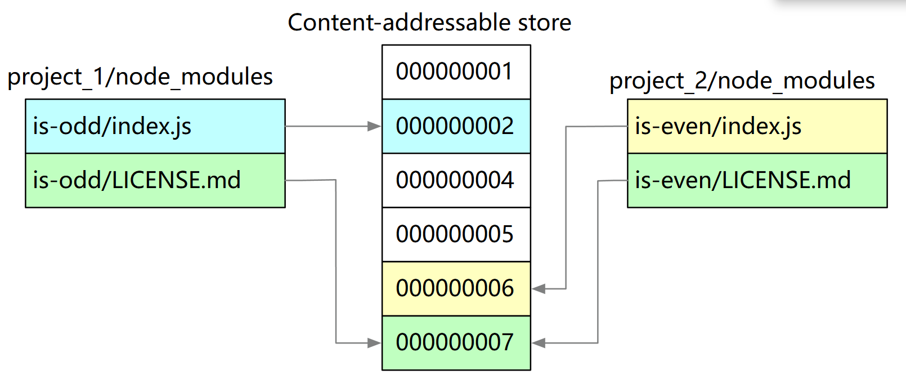

（1）如果我们依赖于不同版本的依赖，则仅将不同的文件添加到存储中。例如，如果它有 100 个文件，并且新版本仅对其中一个文件进行了更改，则 `pnpm update` 将仅向存储添加 1 个新文件，而不是仅针对单个更改克隆整个依赖。

（2）所有文件都保存在磁盘上的一个位置。安装软件包后，它们的文件从该位置进行硬链接，不消耗额外的磁盘空间。这允许我们跨项目共享相同版本的依赖。

因此，可以节省大量磁盘空间，与项目和依赖的数量成正比，并且安装速度更快！

>[pnpm 中文网](https://pnpm.nodejs.cn/)

#### <font size=3>4.3 优缺点</font>

PNPM使用全局存储方法，所有包在一个地方全局存储，不像NPM或Yarn那样。安装包时，PNPM会从全局存储中链接文件到项目的node_modules，因此我们不需要在每个应用中重复存储包，这使得它在磁盘使用上非常高效。尽管PNPM使用非平面的内部结构，但它通过一个称为锁文件（通常命名为pnpm-lock.yaml）的文件提供了依赖项的“扁平化视图”。与NPM或YARN相比，PNPM更快、更轻，因为它利用缓存，并不是每次都安装包。如果包在全局中找到，它将在该项目/应用的node_module中附加符号链接/硬链接。

虽然PNPM更快，但它在市场上相对较新，没有太多人了解它，而NPM和YARN已经存在了很长时间，它可能存在一些与依赖于NPM特定功能的某些原生模块的兼容性问题。PNPM的全局包存储提供了效率优势，但也可能引入潜在的管理开销。例如，你可能需要考虑如何处理清除全局存储或如果多个项目需要同一个包的不同版本时的冲突管理。

>PNPM通过其创新的全局存储和链接机制，提供了一个节省磁盘空间且性能出色的包管理方案。虽然它作为一个较新的选手可能在生态系统支持和原生模块兼容性方面存在一些挑战，但对于那些寻求更高效、更快速的依赖管理工具的开发者而言，PNPM无疑是一个值得尝试的选择。

### <font size=3>5. npx</font>

#### <font size=3>5.1 npx是什么？</font>

npx，Node Package Execute 即node包执行器。它是npm v5.2.0版本之后随npm 一起打包安装的一个包执行器。有了npx 包执行器，用户就可以直接使用 npx 命令去执行指令了，它会自动去寻找二进制命令文件且不必全局安装依赖包。用户可以直接使用 npx 命令去执行一些 npm 指令，如果本地没有安装的话会直接拉取最新的版本安装并执行。

#### <font size=3>5.2 npx和node包管理器？</font>

（1）npm下载安装以来包到本地，然后需要手动删除；npx是临时下载安装依赖包，完成后会自动删除安装包。

（2）运行`npm install`命令的时候，大致的流程是：`npm install`命令输入 &rarr; 检查node_modules目录下是否存在指定的依赖 &rarr; 如果已经存在则不必重新安装 &rarr; 若不存在，继续下面的步骤 &rarr; 向 registry（本地电脑的.npmrc文件里有对应的配置地址）查询模块压缩包的网址 &rarr; 下载压缩包，存放到根目录里的.npm目录里 &rarr; 解压压缩包到当前项目的node_modules目录中；使用`npx` 命令则会直接执行一些指令，如果本地没有安装的话会直接拉取最新的版本安装并执行。

（3）npx 可以在不指定项目中的确切位置或使用别名的情况下运行正确版本的工具

## <font size=3>三、node与npm的应用</font>

### <font size=3>1. 安装node和npm</font>

>参考资料：
>
>- [windows安装npm教程_npm 安装-CSDN博客](https://blog.csdn.net/zhouyan8603/article/details/109039732)
>
>- [Node.js安装及环境配置超详细教程【Windows系统】_windows 安装nodejs-CSDN博客](https://blog.csdn.net/Nicolecocol/article/details/136788200)

#### <font size=3>1.1 获取Node.js</font>

##### <font size=3>1.1.1 方式一：命令行获取</font>

这种方式安装Node.js的时候是可以选默认的包管理器的：

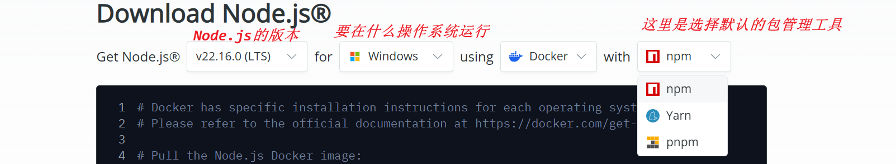

上面那个Using就是要从哪里获取node，这里选Docker，就是在命令行安装。但是我没有用这种方式，我用的另一种。

##### <font size=3>1.1.2 方式二：下载已编译的版本</font>

我们从官网下载node：[Node.js — Download Node.js®](https://nodejs.org/en/download)：


我这里选择免安装版本(有个好处就是便于打包移动)。下载完毕后我们会得到这样一个压缩包：


#### <font size=3>1.2 解压安装</font>

上面下载的是免安装版本，所以直接解压就可以了：

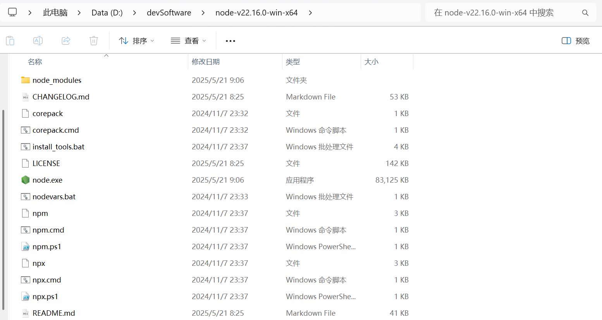

可以看到里面包含了npm、node.exe还有npx。这里我们直接新建 node_cache 和 node_global 目录：

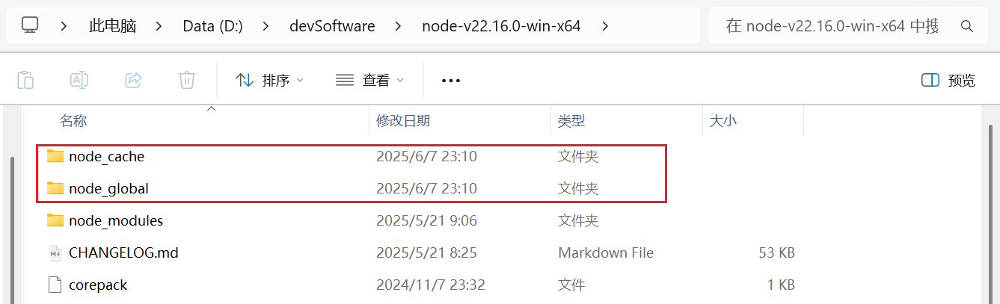

#### <font size=3>1.3 环境变量</font>

这样安装完毕后，只能解压缩的目录用相关的工具，当命令行打开的是其他目录时是无法使用这些安装的内容的，我们把他们的路径添加到环境变量去。

##### <font size=3>1.3.1 【SYSTEM】—— NODE_HOME</font>

新增一个 NODE_HOME 环境变量，【右键此电脑】&rarr;【属性】&rarr;【高级系统设置】&rarr;【高级】&rarr;【环境变量】或者直接【win + r】打开运行窗口，然后运行：

```shell
sysdm.cpl
```

我们在系统环境变量中添加：

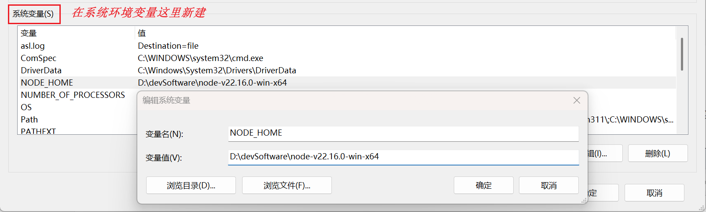

然后我们可以打开文件资源管理器，在地址栏输入 %NODE_HOME% ，然后回车，如果添加没问题的话，应该就可以打node的安装目录了：

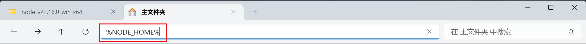

##### <font size=3>1.3.2 【USER】—— Path</font>

和上面一样的步骤：【右键此电脑】&rarr;【属性】&rarr;【高级系统设置】&rarr;【高级】&rarr;【环境变量】，这次我们在用户变量的Path中添加以下三个路径：

```shell
%NODE_HOME%
%NODE_HOME%\node_global
%NODE_HOME%\node_cache
```

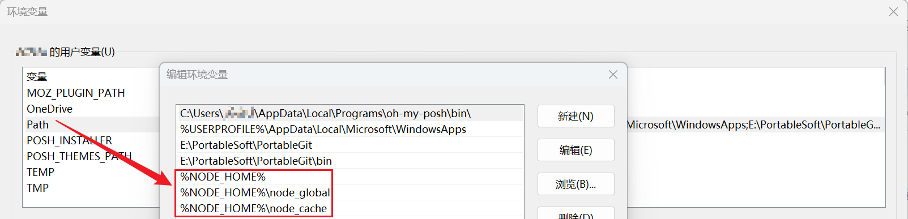

后面两个路径是后面修改了npm安装全局包的目录和缓存目录后要使用的。

##### <font size=3>1.3.3 验证是否生效</font>

上面环境变量配置完毕后，【win+r】&rarr;【cmd】打开命令行，我们输入以下命令查看node和npm是否可用：

```shell
node -v
npm -v
```

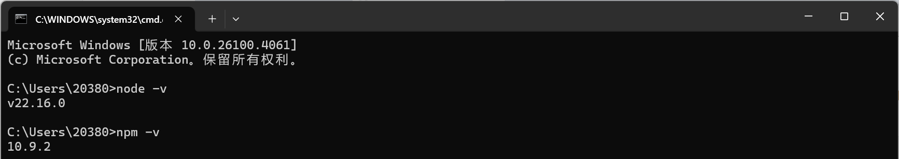

能打印出版本说明安装成功，后续可以正常使用。如果是powershell的话，有可能会出现下面的问题：

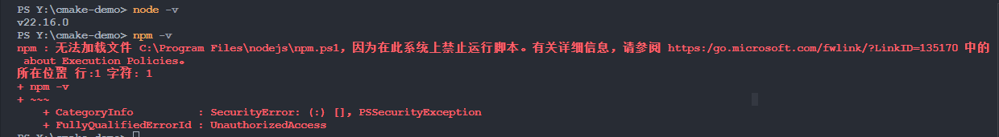

这通常意味着 Windows 的执行策略设置为禁止运行 PowerShell脚本。默认情况下，Windows 可能出于安全考虑，限制了脚本的执行。可以以管理员身份运行powershell，然后执行以下命令：

```shell
Set-ExecutionPolicy RemoteSigned
```

这个命令会将执行策略设置为允许运行本地脚本和远程签名的脚本，但阻止未签名的本地脚本。

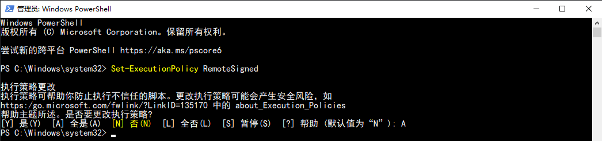

然后重新执行就可以了：


### <font size=3>2. 基本命令</font>

后面其实主要就是使用npm，相关的命令可以看：[CLI 命令 | npm 中文网](https://npm.nodejs.cn/cli/v11/commands)

#### <font size=3>2.1 [npm-init](https://npm.nodejs.cn/cli/v11/commands/npm-init) —— 初始化项目</font>

```shell
# 初始化一个新的npm项目，并引导你创建一个`package.json`文件，该文件包含了项目的基本信息和依赖项。
npm init
```

#### <font size=3>2.2 [npm-install](https://npm.nodejs.cn/cli/v11/commands/npm-install) —— 安装包</font>

```shell
npm install # 安装项目所需的全部依赖（根据package.json文件）
npm install <package_name> # 安装指定名称的包
npm install -g <package_name> # 全局安装一个包

aliases: add, i, in, ins, inst, insta, instal, isnt, isnta, isntal, isntall
```

参数说明：

- --save 或 -S: 添加到package.json文件的dependencies列表中（默认行为）。

- --save-dev 或 -D: 添加到package.json文件的devDependencies列表中，表示该包仅用于开发环境。

- --global 或 -g: 全局安装该包，而不是安装在当前项目中。

- @\<版本号\>: 安装指定版本的包。

#### <font size=3>2.3 [npm-uninstall](https://npm.nodejs.cn/cli/v11/commands/npm-uninstall) —— 卸载包</font>

```shell
# 从项目中移除依赖包，并从package.json文件中删除指定的包。
npm uninstall [<@scope>/]<pkg>...

aliases: unlink, remove, rm, r, un
```

#### <font size=3>2.4 [npm-ls](https://npm.nodejs.cn/cli/v11/commands/npm-ls) —— 列出已安装的包</font>

```shell
npm ls <package-spec>

alias: list
```

参数说明：

- -g: 查看全局已经安装过的node包。

#### <font size=3>2.5 [npm-update](https://npm.nodejs.cn/cli/v11/commands/npm-update) —— 更新包</font>

```shell
npm update [<pkg>...]

aliases: up, upgrade, udpate
```

更新指定包到最新版本。

#### <font size=3>2.6 [npm-run](https://npm.nodejs.cn/cli/v11/commands/npm-run) —— 运行脚本</font>

```shell
npm run-script <脚本名>
```

运行在package.json中定义的脚本。

### <font size=3>3. node配置</font>

#### <font size=3>3.1 node包都安装在哪里了？</font>

我们通过npm安装的包都安装在哪里？我们来全局安装一下hexo：

```shell
npm install -g hexo-cli
```

然后就会看到以下输出信息：

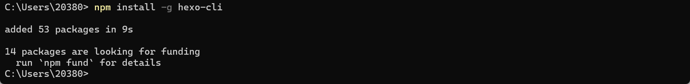

然后我们打开`%LOCALAPPDATA%`目录，会看到这里生成了一个npm-cache目录：

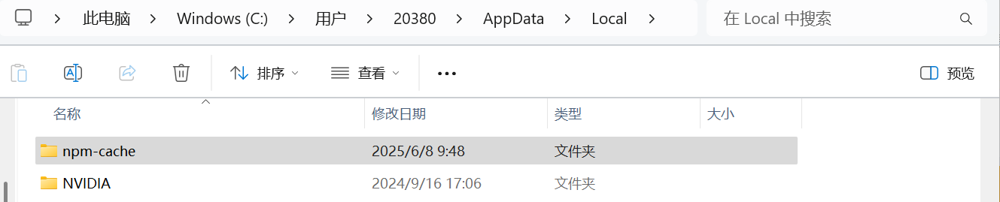

然后打开`%NODE_HOME%`，就会发现hexo相关的命令会出现在这里：

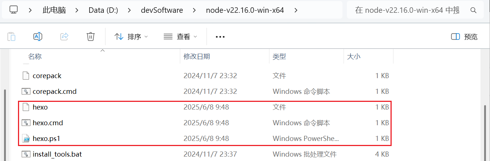

我们再打开`%NODE_HOME%/node_modules`，就会发现，包默认被安装在了这里：

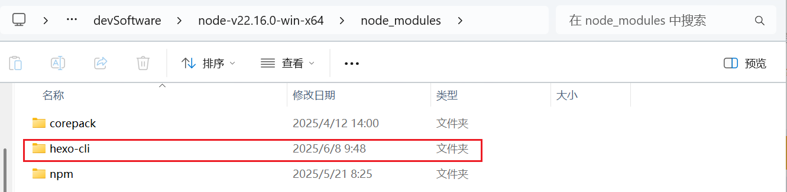

当我们的`%NODE_HOME%`不在C盘时，当然也无所谓，要是在C盘，就会占用很多的空间。

#### <font size=3>3.2 修改目录</font>

我们配置一下，把插件安装到其他目录去，我们在cmd命令行执行：

```shell
npm config set prefix "D:\devSoftware\node-v22.16.0-win-x64\node_global"
npm config set cache "D:\devSoftware\node-v22.16.0-win-x64\node_cache"
```

就是我们刚才新建的两个目录。然后可以通过下面的命令查看配置：

```shell
npm list -g
```

我们可以看一下这个文件 `%USER%\.npmrc`：

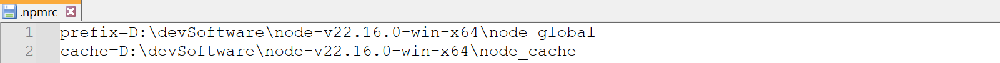

会发现这里出现了两项配置。

#### <font size=3>3.3 验证是否生效</font>

我们可以卸载hexo，然后重新全局安装hexo：

```shell
npm un -g hexo-cli
npm i -g hexo-cli
```

然后我们再看一下node_cache目录：

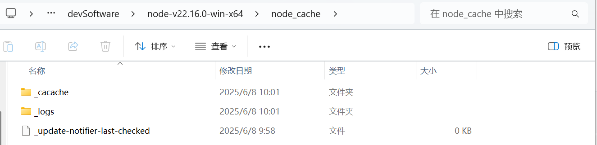

再来看一下 node_global 目录，可以看到命令和相关的包都安装到了这里：

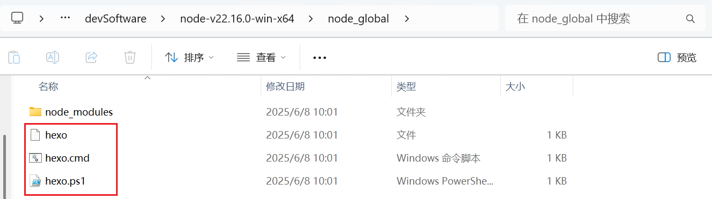


## <font size=3>四、pnpm的应用</font>

### <font size=3>1. pnpm安装配置</font>

#### <font size=3>1.1 通过npm安装</font>

一般默认安装node的时候安装的是npm，要想使用pnpm的话，可以用下面的命令安装：

```shell
npm install -g pnpm
pnpm -v
```

前面已经配置过npm包的位置，所以这里我们会看到pnpm出现在了之前设置的目录中：

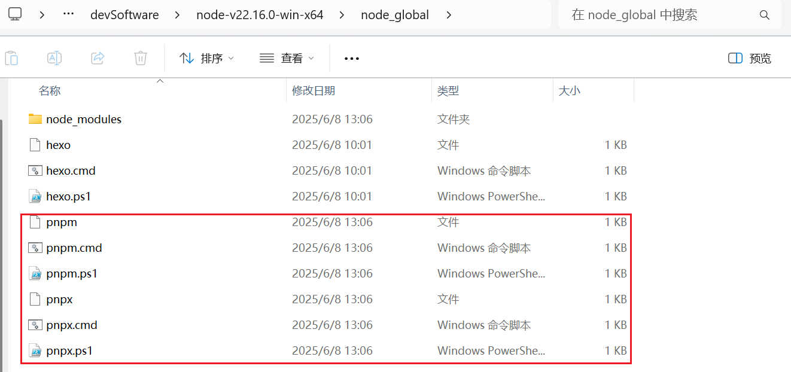


#### <font size=3>1.2 常用配置</font>

网络不好的话，我们还可以配置国内镜像源：

```shell
# 查看当前配置的镜像地址
pnpm config get registry
# 修改pnpm源
pnpm config set registry https://registry.npmmirror.com
```

pnpm安装的包和依赖都是是全局安装，我们可以修改一些目录的位置（默认安装包路径位置是C盘的Local目录下）：

```shell
# 允许设置全局安装包的 bin 文件的目标目录。
pnpm config set global-bin-dir "D:\xxx\pnpm-store"

# 包元数据缓存的位置。
pnpm config set cache-dir "D:\xxx\pnpm-store\pnpm-cache"

# pnpm 创建的当前仅由更新检查器使用的 pnpm-state.json 文件的目录。
pnpm config set state-dir "D:\xxx\pnpm-store\pnpm-state"

# 指定储存全局依赖的目录。
pnpm config set global-dir "D:\xxx\pnpm-store\global"

# 所有包被保存在磁盘上的位置。可选，以下这条命令可以选择不执行也是OK的
pnpm config set store-dir "D:\xxx\pnpm-store\pnpm-store"

```

然后就可以通过pnpm安装包了.

### <font size=3>2. 常用命令</font>

|      npm 命令      |         pnpm 等价命令         |
| :----------------: | :---------------------------: |
|    npm install     |   pnpm install 安装全部依赖   |
|  npm install 包名  | pnpm add (-D) 包名 安装指定包 |
| npm uninstall 包名 |  pnpm remove 包名 移除指定包  |
|    npm run 脚本    |      pnpm 脚本 运行脚本       |

升级版本可以用以下命令：

```shell
pnpm add -g pnpm to update
```

### <font size=3>3. 出现的问题</font>

> 参考资料：[pnpm 基本详细使用教程（安装、卸载、使用、可能遇到的问题及解决办法）-CSDN博客](https://blog.csdn.net/m0_56416743/article/details/136122153?fromshare=blogdetail&sharetype=blogdetail&sharerId=136122153&sharerefer=PC&sharesource=yimeng_Sama&sharefrom=from_link)

但是最开始使用可能有以下问题：

```shell
pnpm i -g yrm
```

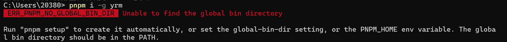

下面其实已经告诉我们要怎么做了，如果直接运行`pnpm setup`的话，会自动使用官方的一些默认配置，将一些文件安装到`%LOCALAPPDATA%`，也就是C盘的Local目录，有三种方法解决。

#### <font size=3>3.1 方式一：默认</font>

- （1）默认直接执行命令，这样会直接把相关的内容安装到`%LOCALAPPDATA%`中。

之前我没有对pnpm做任何配置，我们执行一下`pnpm setup`看一下：

```shell
pnpm setup
```

会得到如下打印信息：

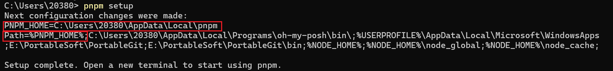

其实就是定义了两个环境变量：

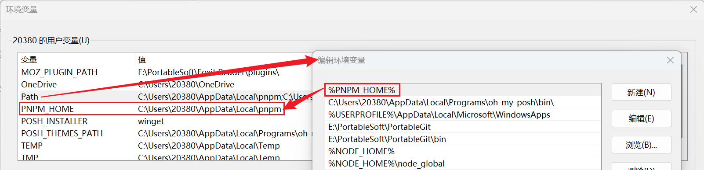

接下来新打开一个windows终端，就可以直接使用了（要是不行，就重启一下电脑），我们再次执行安装yrm的命令：

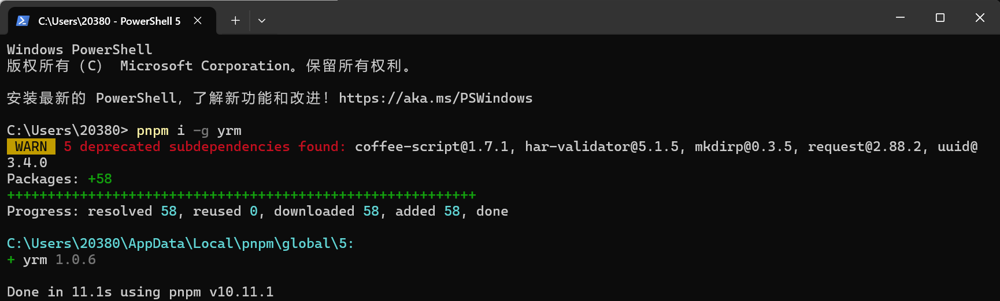

其实从提示信息可以看到，这里其实就是安装到了`%LOCALAPPDATA%\pnpm\global`目录中，我们看一下`%LOCALAPPDATA%`目录：

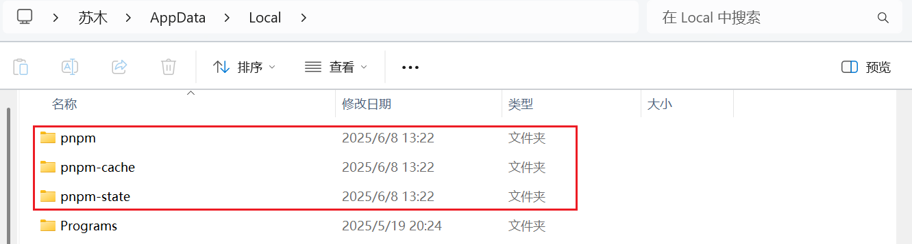

从上述两张图中以及它自动配置的用户变量中，我们可以很容易的知道它默认是安装在C盘的Local目录下的。对于其这一点官网有明确的说明，[**文件默认安装位置路径。**](https://pnpm.io/settings#globaldir)

#### <font size=3>3.2 方式二：先配置环境变量</font>

- （2）删除上一种方式创建的环境变量和生成的目录，重启电脑，然后直接配置相关的环境变量后再运行`pnpm setup`。

我们可以和上面一样，在用户变量中创建PNPM_HOME并指定路径，然后添加到Path中，只是提前指定好路径，也可以在系统环境变量操作，然后要是没生效就重启下电脑。

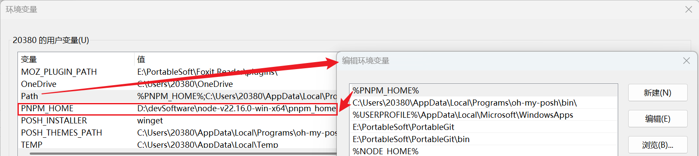

然后执行`pnpm setup`，再执行yrm安装命令：

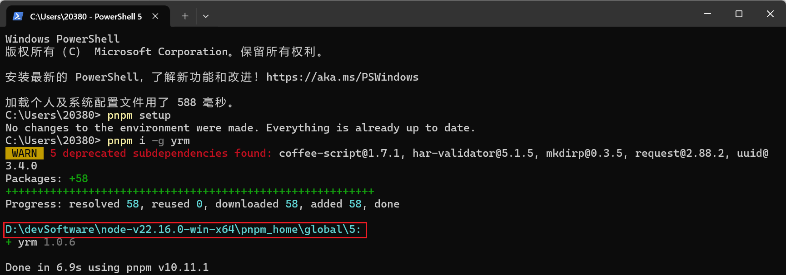

从这里就可以知道，刚才设置的环境变量生效了。现在yrm已经安装到了指定的目录。但是这种方式，还需要修改`pnpm-cache`和`pnpm-state`两个文件夹的位置，当手动修改完pnpm的环境变量后，使用pnpm安装依赖时，会发现pnpm-cache和pnpm-state这两个文件仍然在C盘目录下，如下图：

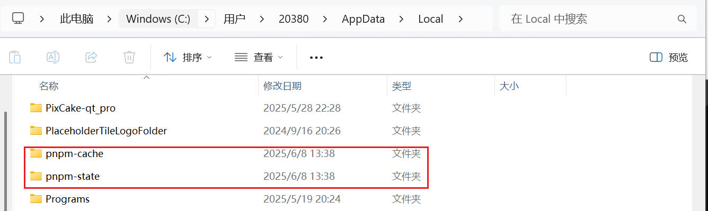

这个时候我们需要通过命令来配置：

```shell
# 包元数据缓存的位置。
pnpm config set cache-dir "D:\devSoftware\node-v22.16.0-win-x64\pnpm_home\pnpm-cache"
# pnpm 创建的当前仅由更新检查器使用的 pnpm-state.json 文件的目录。
pnpm config set state-dir "D:\devSoftware\node-v22.16.0-win-x64\pnpm_home\pnpm-state"
```

我们卸载后重新安装yrm，提前删除上面c盘相关的文件，然后就会发现，两个目录已经不在c盘了，会在刚才设置的目录中：

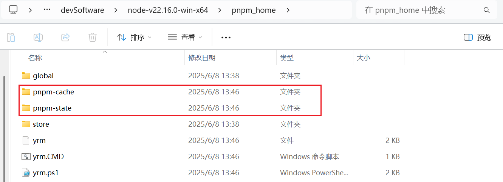

#### <font size=3>3.3 方式三：直接命令配置</font>

- （3）使用上面的命令设置好文件的安装位置，然后再运行`pnpm setup`。

```shell
# 允许设置全局安装包的 bin 文件的目标目录。
pnpm config set global-bin-dir "D:\devSoftware\node-v22.16.0-win-x64\pnpm-home"
# 包元数据缓存的位置。
pnpm config set cache-dir "D:\devSoftware\node-v22.16.0-win-x64\pnpm-home\pnpm-cache"
# pnpm 创建的当前仅由更新检查器使用的 pnpm-state.json 文件的目录。
pnpm config set state-dir "D:\devSoftware\node-v22.16.0-win-x64\pnpm-home\pnpm-state"
# 指定储存全局依赖的目录。
pnpm config set global-dir "D:\devSoftware\node-v22.16.0-win-x64\pnpm-home\pnpm-global"
# 所有包被保存在磁盘上的位置。
#（可选，以下这条命令可以选择不执行也是OK的）
pnpm config set store-dir "D:\devSoftware\node-v22.16.0-win-x64\pnpm-home\pnpm-store"
```

这里的路径中文件夹可以事先自行建立好文件的储存路径，也可以直接不用实现建立好文件的储存路径，因为，当我们配置好pnpm后，使用pnpm安装依赖时，你命令中所设置的所有路径即文件夹，都会按照层次级别自动生成的。设置完成后，会在`%LOCALAPPDATA%\pnpm\config`目录中生成一个配置文件。

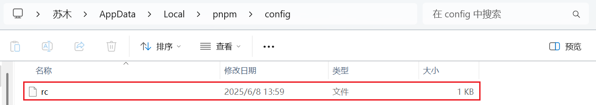

这个文件的内容如下：

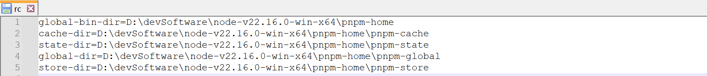

这里刚好就是前面设置的路径，然后我们运行`pnpm setup`是会有问题的：

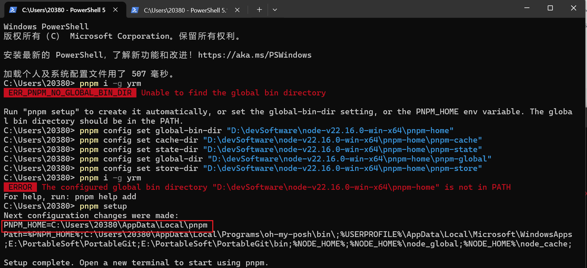

就会发现根本没有修改成功。这个时候我们还需要配置PNPM环境变量（PNPM环境变量映射），这里所配置的PNPM的环境变量与前面两种方法中所配置的PNPM环境变量是完全不一样的，是有巨大的差异的。虽然它们的名称都是PNPM_HOME，但是它们各自代表的含义是不同的，此处在这里所配置的PNPM环境变量，代表的是全局安装包的 bin 文件的目标目录。而上面两种方法中所配置的PNPM环境变量，代表的是储存全局依赖的目录。

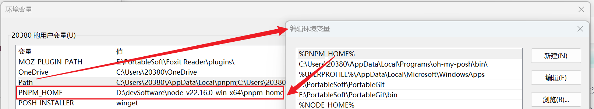

然后再执行`pnpm setup`，然后重新安装：

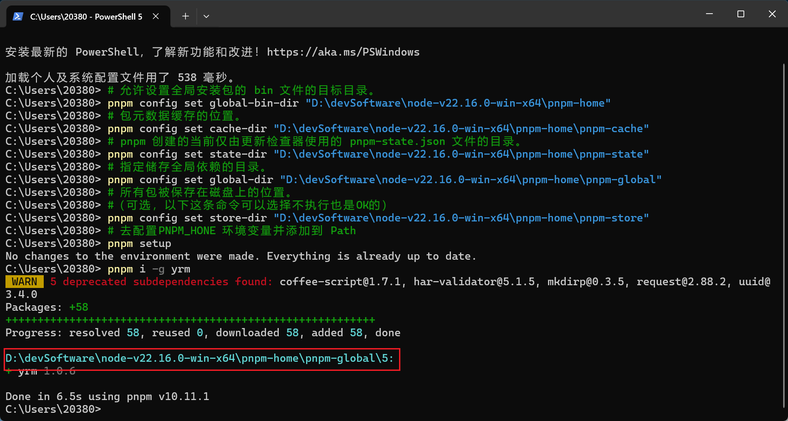

安装完毕后查看一下，就会发现这里自动生成了相关的目录和文件：

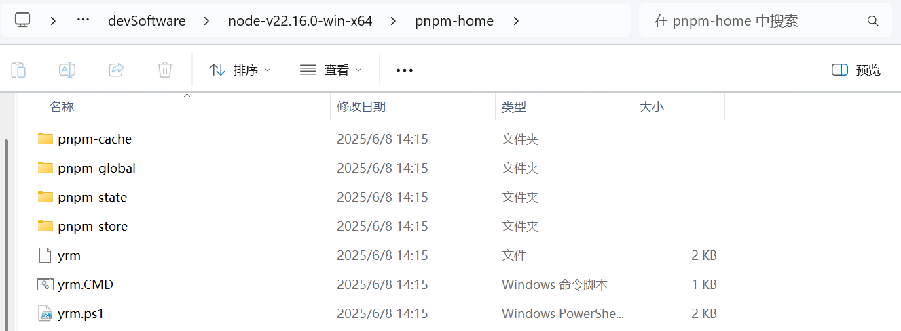
