<!-- more -->

## <font size=3>一、npm项目工程</font>

### <font size=3>1. 初始化npm工程</font>

首先肯定需要初始化一个npm项目工程啦，直接执行：

```shell
npm install -y
```

这样不需要交互，就会直接生成一个默认的`package.json`：

```json
{
  "name": "sdoc-cli",
  "version": "1.0.0",
  "main": "index.js",
  "scripts": {
    "test": "echo \"Error: no test specified\" && exit 1"
  },
  "keywords": [],
  "author": "",
  "license": "ISC",
  "description": ""
}
```

### <font size=3>2. 安装依赖</font>

执行下面的命令：

```shell
npm install
```

上面建立的是空的工程，所以其实也没有什么依赖安装，但是还是会生成一个`package-lock.json`文件。

### <font size=3>3. 创建index.js</font>

我们创建index.js文件，里面打印一个hello world：

```json
console.log(`✅ Hello, World!`);
```

## <font size=3>二、怎么运行？</font>

### <font size=3>1. node命令</font>

我们进入 index.js 所在目录，执行：

```shell
node ./index.js
```

然后就会看到以下内容被打印出来：

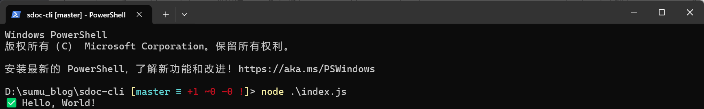

### <font size=3>2. 还有别的办法吗？</font>

我们还可以用npm run命令，但是需要修改`package.json`：

```json
{
  //......
  "scripts": {
    "test": "echo \"Error: no test specified\" && exit 1",
    "hello": "node index.js"
  },
  // ......
}

```

在script这里添加hello脚本，我们执行一下：

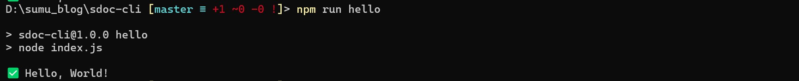

发现也是可以运行的。

### <font size=3>3. 能全局运行吗？</font>

#### <font size=3>3.1 本地包全局安装</font>

上面两个只能在工程目录下运行，我要是想在命令行的任意地方运行，该怎么做？就像node、npm等命令一样。当然也可以啦。我们需要修改`package.json`，添加一个名为`bin`的键，它的值为我们自定义的命令的名称，例如：

```json
{
  //......
  "bin": {
    "sdoc": "./index.js"
  },
  //......
}

```

然后我们就要用到`npm link` 命令了，它是一个非常有用的命令，用于在开发过程中将本地 npm 包链接到全局 npm 目录，从而可以在其他项目中使用这个本地包，而**不需要发布到 npm 仓库**。这对于本地开发和测试非常有帮助。我们进入项目的目录执行：

```shell
npm link
```

这个命令会在全局 npm 目录中创建一个符号链接，指向我们当前的本地包，我们会看到以下打印信息：

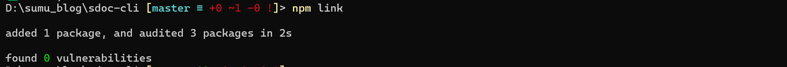

然后会在npm全局安装目录中看到如下内容：

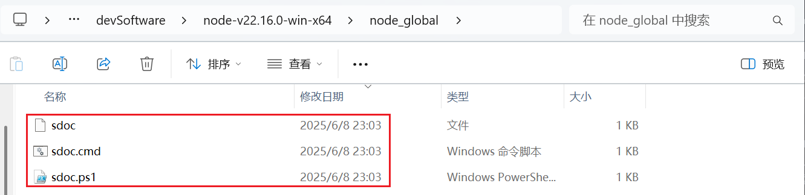

这里出现了一些文件，这些文件就算是可执行文件，也可以算是命令行的命令。我们会在全局安装目录的node_modules目录中看到这里有一个快捷方式：

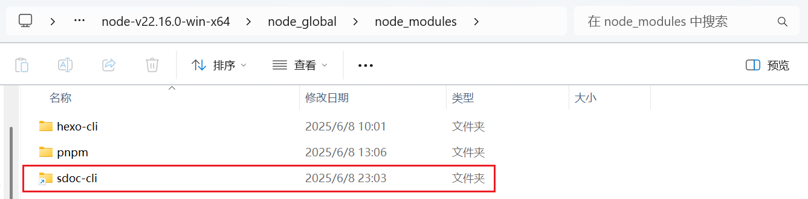

这个就是执行我们的本地npm项目了。

#### <font size=3>3.2 出现问题？</font>

然后我们在命令行执行：

```shell
sdoc
```

然后就出问题了：

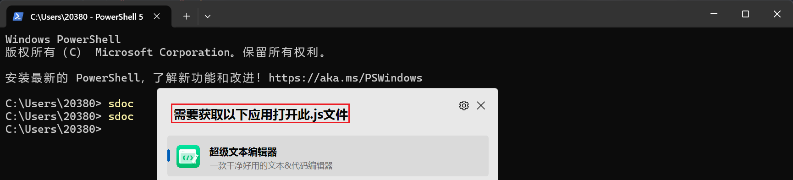

无法运行？好像是不知道要以什么应用来运行这个命令，原来是还需要修改index.js：

```json
#!/usr/bin/env node 

console.log(`✅ Hello, World!`);
```

第一行的作用就是让系统知道这是 Node 脚本。然后重新执行`npm link`，再重新执行：

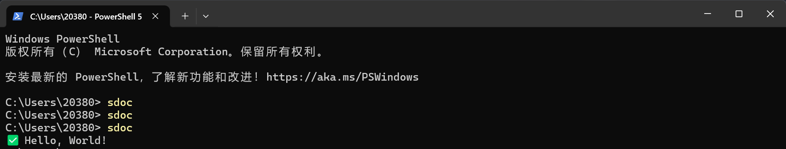

终于可以了！！！

#### <font size=3>3.3 怎么卸载？</font>

进入sdoc-cli目录，执行：

```shell
npm un -g     # 若是在其他目录，还要加上包名
npm unlink -g # 这个也可以
```

## <font size=3>三、发布到npm</font>

### <font size=3>1. 登录npm</font>

我们在命令行执行：

```shell
npm login
```

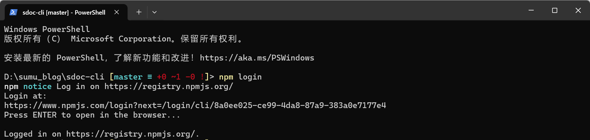

然后就会跳转到npm登录页面，登录自己的账号即可。可以通过下面的命令验证登录状态：

```shell
npm whomi
```

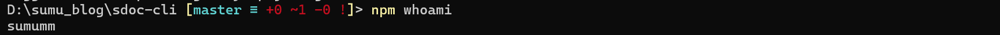

### <font size=3>2. 发布</font>

直接执行：

```shell
npm publish
```

会看到以下输出：

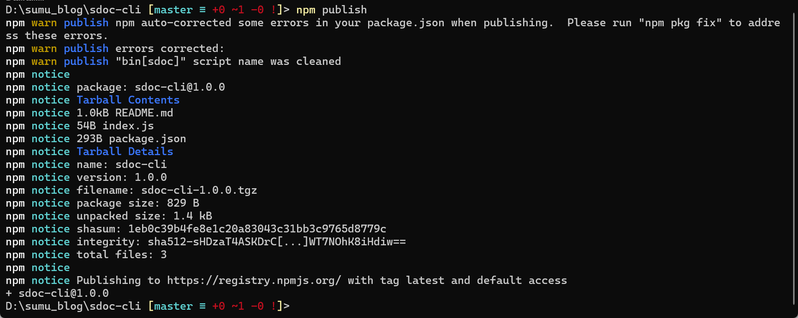

然后我们去npm个人页面看一下：

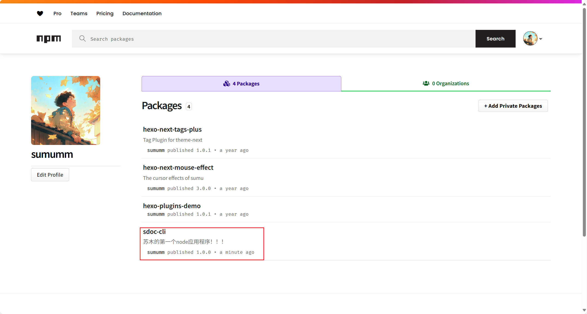

就会看到自己发布的npm包啦。

## <font size=3>四、接收参数？</font>

是不是可以接收一些参数，来帮我处理一些命令？比如经常写md文档，是不是可以执行 `sdco n xxx.md`，这样直接创建一个指定格式的md文档？

### <font size=3>1. 怎么获取命令行参数？</font>

在学习c语言或者shell的时候知道，他们有argc、argv参数，可以获取到来自命令行的参数，那么javasrcipt呢？我们可以看一下Node.js文档：[process 进程 | Node.js v24 文档](https://nodejs.cn/api/process.html#process_process_argv)，这里有说明。

process.argv 返回当前进程的所有命令行参数，返回值是一个数组，前2个元素是node命令路径和被执行的文件路径，我们可以看一下文档的实例：

```javascript
const { argv } = require('node:process');

// print process.argv
argv.forEach((val, index) => {
  console.log(`${index}: ${val}`);
});
```

以如下方式启动 Node.js 进程：

```shell
node process-args.js one two=three four 
```

将会有以下输出：

```shell
0: /usr/local/bin/node
1: /Users/mjr/work/node/process-args.js
2: one
3: two=three
4: four
```

所以我们自己的参数的索引是从2开始的。所以我们可以通过这种方式来获取名命令行的参数。

### <font size=3>2. commander</font>

#### <font size=3>2.1 简介</font>

对于命令行参数的解析，我们有现成的模块可以使用，那就是 [Commander](https://commander.nodejs.cn/) ，`commander.js` 是一个广受欢迎的 Node.js 包，它为开发者提供了一套简洁而强大的 API，用于快速创建功能完备、用户友好的命令行界面（CLI）应用程序。源码仓库是 [tj/commander.js](https://github.com/tj/commander.js)，关于具体的使用方法，可以直接看文档：

- [开发文档 | Commander 中文网](https://commander.nodejs.cn/docs/)
- [commander.js/Readme_zh-CN.md at master · tj/commander.js · GitHub](https://github.com/tj/commander.js/blob/master/Readme_zh-CN.md)

#### <font size=3>2.2 安装commander</font>

```shell
npm install commander
```

#### <font size=3>2.3 commander demo</font>

源码中为我们提供了大量的example：[commander.js/examples at master · tj/commander.js · GitHub](https://github.com/tj/commander.js/tree/master/examples)

#### <font size=3>2.4 添加一个 sdoc n 子命令</font>

我们修改index.js如下：

```json
#!/usr/bin/env node

const commander = require('commander');
const program = new commander.Command();

program
	.command('n')
	.description('print hello world!')
	.action(() => {
		console.log(`✅ Hello, World!`);
	});

program.parse();
```

#### <font size=3>2.5 接收一个参数？</font>

我们向sdoc n命令传递一个参数：

```shell
#!/usr/bin/env node

const commander = require('commander');
const program = new commander.Command();

program
	.command('n')
	.argument('[fileName]', 'file name', 'demo')
	.description('print hello world!')
	.action((fileName) => {
		console.log('✅ Hello, World! fileName:', fileName);
	});

program.parse();
```

## <font size=3>五、文件操作</font>

我现在主要是有两个需求，一个是按照固定模板创建md文档，另一个是替换文档中的图片相对路径，我们接下来一步一步实现这两个功能。

### <font size=3>1. 要用哪些模块</font>

#### <font size=3>1.1 Node.js 文件系统</font>

Node.js 的文件系统模块（**fs** 模块）提供了丰富的 API，用于读取、写入、删除文件以及执行其他文件系统操作。fs 模块既支持同步方法也支持异步方法，使得开发者可以根据具体需求选择合适的方式来处理文件操作。这里可以参考中文文档：[fs 文件系统 | Node.js v24 文档](https://nodejs.cn/api/fs.html)，也可以参考[Node.js 中文网 — Node.js 简介](https://nodejs.cn/en/learn)中操作文件相关部分。

Node.js 文件系统（fs 模块）模块中的方法均有异步和同步版本，例如读取文件内容的函数有异步的 fs.readFile() 和同步的 fs.readFileSync()。异步的方法函数最后一个参数为回调函数，回调函数的第一个参数包含了错误信息(error)。建议使用异步方法，比起同步，异步方法性能更高，速度更快，而且没有阻塞。

#### <font size=3>1.2 readline模块</font>

Node.js 的 `readline` 模块是一个用于从可读流（如 `process.stdin`）逐行读取数据的接口。它提供了一种简单的方式来处理命令行输入，非常适合创建交互式命令行应用程序。可以参考：[readline 逐行读取 | Node.js v24 文档](https://nodejs.cn/api/readline.html#逐行读取)

### <font size=3>2. 创建markdown文档</font>

#### <font size=3>2.1 功能实现</font>

我们通过fs模块来实现文件的创建和读写，通过readline模块实现

```javascript
#!/usr/bin/env node

const commander = require('commander');
const fs = require('fs');
const readline = require('readline');

const program = new commander.Command(); /* 创建命令行程序实例 */

/* 创建readline接口用于用户交互 */
const rl = readline.createInterface({
	input: process.stdin,
	output: process.stdout
});

/* 创建markdown文件 */
async function createMarkdownFile(fileName) {
	const filePath = `${fileName}.md`;
	const content = `# ${fileName}\n\n`;

	// 检查文件是否已存在
	if (fs.existsSync(filePath)) {
		const answer = await new Promise(resolve => {
			rl.question(`File ${filePath} already exists. Overwrite? (y/n) `, resolve);
		});

		// 用户取消操作
		if (answer.toLowerCase() !== 'y') {
			console.log('Operation cancelled');
			rl.close();
			return;
		}
	}

	// 创建/覆盖文件
	fs.writeFileSync(filePath, content, 'utf8');
	console.log(`Created ${filePath}`);
	rl.close();
}

/* 配置命令行参数和选项 */
program
	.command('n')
	.argument('[fileName]', 'file name', 'demo')
	.description('create markdown file!')
	.action(createMarkdownFile);

/* 解析命令行参数 */
program.parse();

```

#### <font size=3>2.2 说明</font>

我们进入项目目录，执行：

```shell
node .\index.js n       # 创建 demo.md
node .\index.js n js文档 # 创建 js文档.md
```

命令执行时，会先检测文件是否存在，若是存在则会提示是否覆盖，若是不存在则会直接创建。

### <font size=3>3. 按模板创建</font>

完整的源码可以看这里：[GitHub - docs-site/sdoc-cli: 我的npm命令](https://github.com/docs-site/sdoc-cli)（随着时间推移，可能更新了，但是大概逻辑是一样的）

#### <font size=3>3.1 什么样的模板？</font>

一般静态网页的生成器在渲染markdown文档的时候都需要一些文档信息，如：

```markdown
---
title: {{ title }}
date: {{ date }}
icon: famicons:logo-markdown
index: true
tags:
categories:
---

<!-- more -->

```

我现在希望可以自动填充文件标题和创建时间，时间信息为`YYYY-MM-DD HH:MM:SS`。我们把模板命名为post.md，放在scaffolds目录下。

#### <font size=3>3.2 获取时间</font>

怎么获取时间？参考一下这里：[日期 - JavaScript | MDN Web 中文网](https://web.nodejs.cn/en-us/docs/web/javascript/reference/global_objects/date/)，JavaScript `Date` 对象以独立于平台的格式表示单个时刻。`Date` 对象封装一个整数，表示自 UTC（纪元）1970 年 1 月 1 日午夜开始以来的毫秒数。这个可作为单独的模块，方便调用，我们编写一个 utils/sys_time.js 来实现时间的获取：

```javascript
/**
 * @file 日期时间工具
 * @module utils/sys_time
 * @description 提供日期时间格式化和处理功能
 */

/**
 * 获取当前日期时间 (YYYY-MM-DD HH:MM:SS 格式)
 * @returns {string} 格式化的日期时间字符串
 */
function getCurrentDateTime() {
	const now = new Date();
	
	// 使用 padStart(2, '0') 确保单数位数字补零（如 9 → 09）
	const year = now.getFullYear();
	const month = String(now.getMonth() + 1).padStart(2, '0'); // 月份从0开始需+1
	const day = String(now.getDate()).padStart(2, '0');

	const hours = String(now.getHours()).padStart(2, '0');
	const minutes = String(now.getMinutes()).padStart(2, '0');
	const seconds = String(now.getSeconds()).padStart(2, '0');

	return `${year}-${month}-${day} ${hours}:${minutes}:${seconds}`; // 组合成目标格式
}

module.exports = {
	getCurrentDateTime
};
```

这样们就创建了一个获取时间的模块，最后通过 module.exports 导出了一个包含函数 getCurrentDateTime 的对象，我们可以这样使用：

```javascript
const getTime = require('./utils/sys_time');
console.log(getTime.getCurrentDateTime()); // 通过对象属性调用
console.log(`⏰ 创建时间: ${getTime.getCurrentDateTime()}`);
```

#### <font size=3>3.3 读取文件</font>

读取文件我们可以使用fs模块的readFileSync函数：

```javascript
/* 读取模板文件 */
function readTemplate(templatePath) {
	try {
		return fs.readFileSync(templatePath, 'utf8');
	} catch (err) {
		console.error(`❌ 模板文件读取失败: ${templatePath}`);
		console.error(err.message);
		process.exit(1);
	}
}
```

这里的try表示尝试执行读取文件，下面的catch表示处理错误代码，读取的时候指定 utf8 会返回字符串，可以直接处理，但是不指定返回的应该是地址。在调用的时候我们还要用到 Node.js 的 [path 路径](https://nodejs.cn/api/path.html) 模块来处理路径：

```javascript
const path = require('path');

// 1. 确定模板路径
const templatePath = path.join(__dirname, 'scaffolds', 'post.md');
// 2. 读取模板内容
const template = readTemplate(templatePath);
console.log(template);
```

#### <font size=3>3.4 替换占位符</font>

可以读取文件了，那么怎么把里面的 `{{ title }}`和 `{{ date }}`替换成标题和时间呢？我们这个时候要用到字符串的replace方法：

```javascript
/* 替换模板内容 */ 
function generateContent(template, name) {
	return template
		.replace(/{{ title }}/g, name)
		.replace(/{{ date }}/g, getTime.getCurrentDateTime());
}
```

我们传入要处理的字符串，通过replace方法全局替换。

#### <font size=3>3.5 完整的demo</font>

##### <font size=3>3.5.1 index.js</font>

```javascript
#!/usr/bin/env node

const commander = require('commander');
const path = require('path');
const fs = require('fs');
const readline = require('readline');
const getTime = require('./utils/sys_time');

const program = new commander.Command(); /* 创建命令行程序实例 */

/* 创建readline接口用于用户交互 */
const rl = readline.createInterface({
	input: process.stdin,
	output: process.stdout
});

/* 读取模板文件 */
function readTemplate(templatePath) {
	try {
		return fs.readFileSync(templatePath, 'utf8');
	} catch (err) {
		console.error(`❌ 模板文件读取失败: ${templatePath}`);
		console.error(err.message);
		process.exit(1);
	}
}

/* 替换模板内容 */ 
function generateContent(template, name) {
	return template
		.replace(/{{ title }}/g, name)
		.replace(/{{ date }}/g, getTime.getCurrentDateTime());
}

/* 创建markdown文件 */
async function createMarkdownFile(fileName) {
	const filePath = `${fileName}.md`;

	// 1. 确定模板路径
	const templatePath = path.join(__dirname, 'scaffolds', 'post.md');
	// 2. 读取模板内容
	const template = readTemplate(templatePath);

	// 3. 生成文件内容
	const content = generateContent(template, fileName);

	// 检查文件是否已存在
	if (fs.existsSync(filePath)) {
		const answer = await new Promise(resolve => {
			rl.question(`File ${filePath} already exists. Overwrite? (y/n) `, resolve);
		});

		// 用户取消操作
		if (answer.toLowerCase() !== 'y') {
			console.log('Operation cancelled');
			rl.close();
			return;
		}
	}

	// 创建/覆盖文件
	fs.writeFileSync(filePath, content, 'utf8');
	console.log(`Created ${filePath}`);
	rl.close();

	console.log(`✅ 文档已生成: ${filePath}`);
	console.log(`📋 使用模板: ${path.relative(process.cwd(), templatePath)}`);
	console.log(`⏰ 创建时间: ${getTime.getCurrentDateTime()}`);
}

/* 配置命令行参数和选项 */
program
	.command('n')
	.argument('[fileName]', 'file name', 'demo')
	.description('create markdown file!')
	.action(createMarkdownFile);

/* 解析命令行参数 */
program.parse();

```
